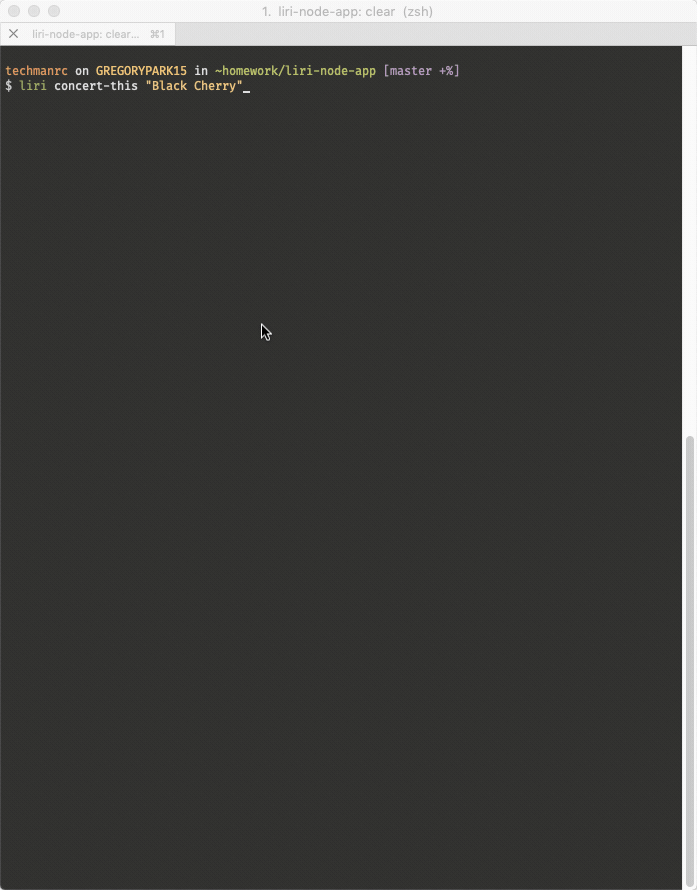
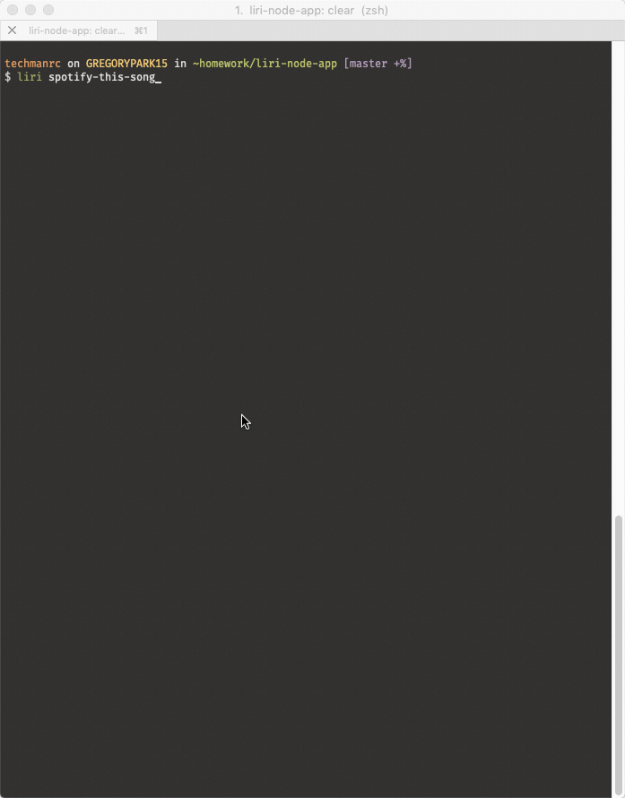

# LIRI Bot

* LIRI is a Language Interpretation and Recognition Interface.
* LIRI searches Spotify for songs, Bands in Town for concert events, and 
  OMDB for movies information.

## Prepare the Application

To use the application, you will need to have API credentials for Spotify, 
Bands In Town, and OMDB.

1. Clone the repository to your computer.
2. Once cloned, change into the directory with the cloned files.
3. At the command prompt type `npm install` and press <Enter>
4. While in the root folder of the project, create a file called `.env`.
5. Within the .env file, create the following entries:

```dotenv
SPOTIFY_ID=<spotify_client_id>
SPOTIFY_SECRET=<spotify_client_secret>
OMDB_KEY=<omdb_api_key>
BITS_APP_ID=<bands_in_town_app_id>
```
   
   There should be no spaces around the equal sign, and the values should 
   not be surrounded by quotes.
6. Save the file once you have updated the credentials.

# What it does

LIRI Bot provides the capability to collect information from various sources 
and display the results on the screen. The following commands are implemented:

## concert-this

To use this command, it's called with `liri concert-this "Michael McDonald"`
This will issue a request to the Bands in Town API and return any future
performances for the specified artist. In particular, it returns the
following information:

* The Artist/Band name
* The Event Date
* The venue name
* The venue location

If you call the command without supplying an artist name, you will be presented
with a help screen indicating how to use the `liri` application, and what you
need to provide to execute the command.

The image below shows an example of the results of executing this command.



## spotify-this-song

The `spotify-this-song` command will look up the provided song name using the
Spotify API, and return information about the song.

If you do not provide a song name with the command, the application will use
a predefined default.

This command returns the following information about a song:

* The song artist(s).
* The full song name.
* A preview link of the song.
* The album to which the song belongs.

The image below shows an example of the results of executing this command
with and without a song name.




## movie-this

The `movie-this` command will look up the provided movie title using the 
Online Movie Database API, and return information about the movie.

If you do not provide a movie title with the command, the application will
use a predefined default.

This command returns the following information about a movie title:

* The title of the movie.
* The year the movie was released.
* The IMDB rating for the movie.
* The Rotten Tomatoes rating for the movie.
* The country where the movie was produced.
* The primary Language of the movie.
* The movie's plot.
* The Actors in the movie.

The images below show examples of the results of executing this command with
and without a movie title.


## do-what-it-says

The `do-what-it-says` command will read the commands.csv file and execute the
commands in the file.

The commands.csv file is in the format of:

```csv
command,parameter
```

This file does not contain a header line, and expects to have a command,
and its input, as one line per command.

The image below shows an example of the results of executing this command.


